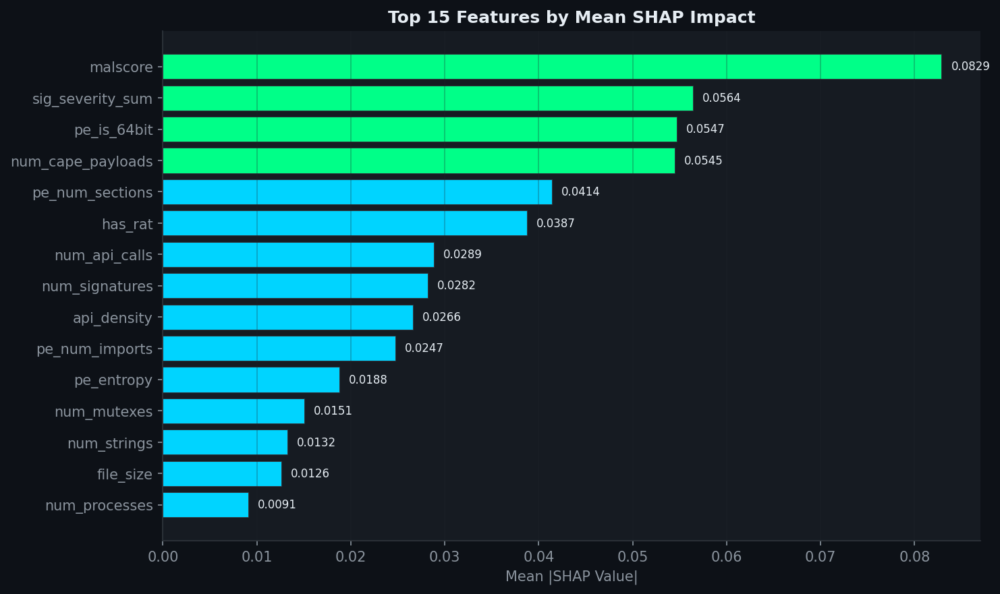
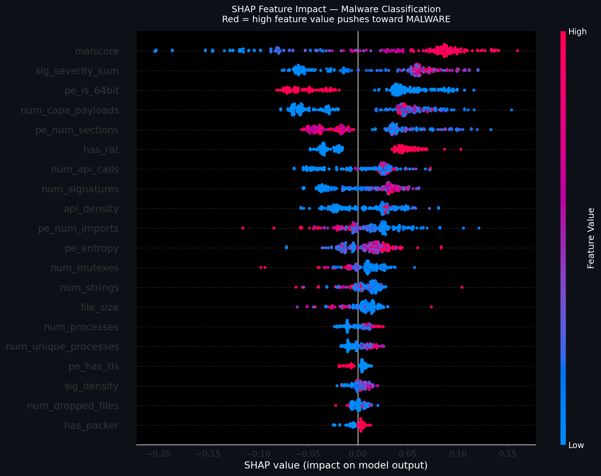
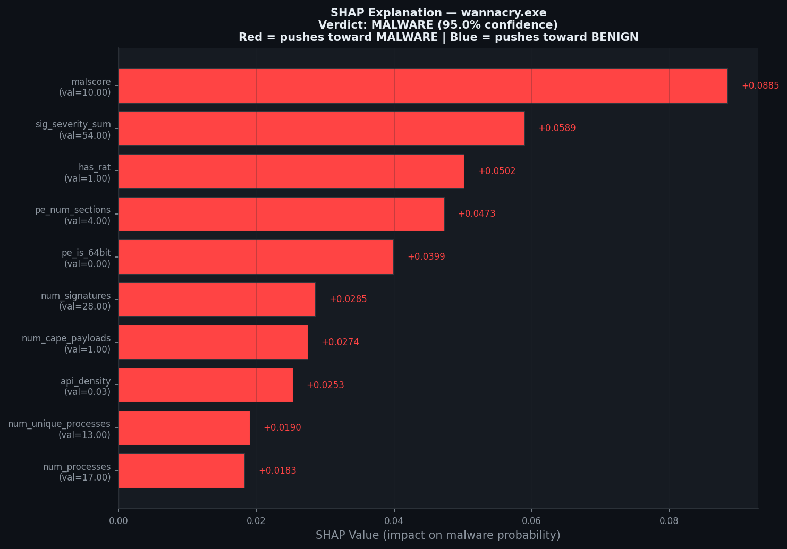
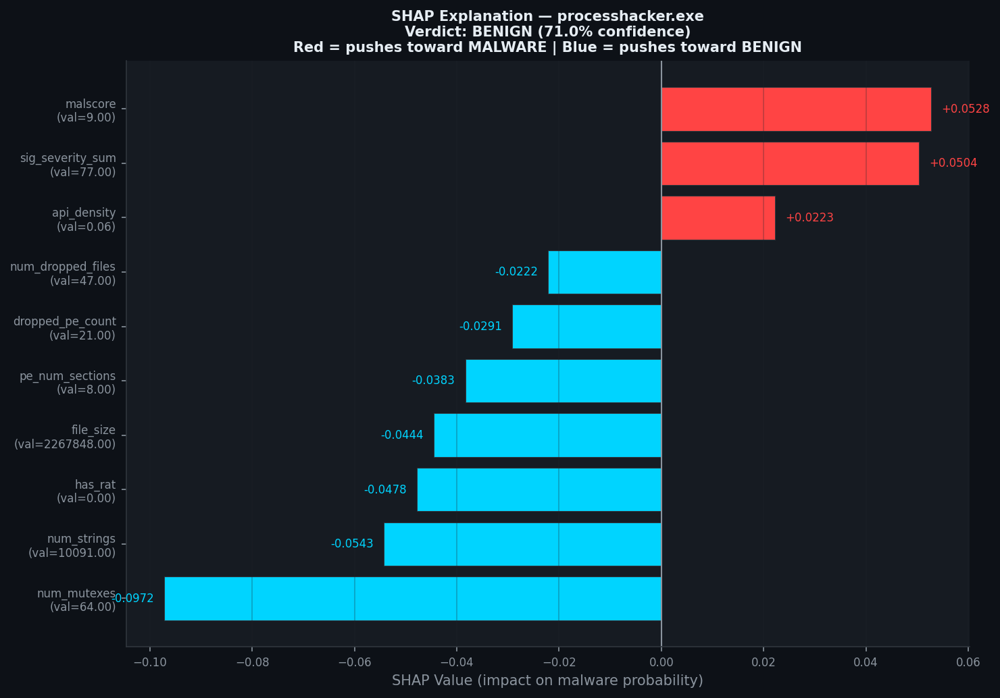

# MalTrace — Behavioral Malware Analysis Pipeline

> CAPEv2 sandbox · Random Forest · SHAP Explainability · MITRE ATT&CK · 64 malware families

[](https://python.org)
[](docs/VALIDATION.md)
[](docs/VALIDATION.md)
[](docs/family_holdout_results.json)
[](docs/chaos_results.json)

---

## What This Is

Most ML malware classifiers train and test on the same families — they measure memorization, not generalization. MalTrace is built around the honest test: **hold out entire malware families during training**, run the model on families it has never seen, and report what actually happens.

This is a full detection engineering pipeline — not a notebook experiment. It runs live malware in a sandboxed environment, extracts behavioral features, classifies with a Random Forest, explains every prediction with SHAP, and maps detections to MITRE ATT&CK techniques.

---

## Architecture

```
Windows 10 Host (VMware Workstation)
│
├── OOB Management Layer — vmrun_bridge.py  (192.168.75.1:9090)
│   ├── POST /vm/start       → vmrun.exe start <vmx>
│   ├── POST /vm/stop        → vmrun.exe stop <vmx>
│   └── POST /snapshot/revert → vmrun.exe revertToSnapshot
│
└── Ubuntu 24.04 VM  (192.168.75.133)
    ├── CAPEv2 Sandbox        → localhost:8000
    │   └── Flare VM Guest    (192.168.75.131, Host-Only, NO internet)
    │       ├── CAPE Agent 0.20
    │       ├── Windows Defender DISABLED
    │       └── Snapshot: flare-clean
    │
    └── ML Pipeline           → Flask API :5000
        ├── feature_extractor.py   (54 behavioral features)
        ├── train_model.py         (Random Forest training)
        ├── shap_explain.py        (SHAP + MITRE ATT&CK)
        └── app.py                 (REST API)
```

**Why VMware instead of KVM?**
CAPEv2 defaults to libvirt/KVM. Running Ubuntu inside VMware makes nested KVM unstable. Instead of fighting the environment, I built a custom Out-of-Band control layer — a Flask server on the Windows host that exposes `vmrun.exe` as HTTP endpoints, paired with a custom `VMwareBridge` machinery module that replaces libvirt entirely. The sandbox thinks it's talking to libvirt. It's actually talking to VMware through HTTP.

---

## Results

### Family-Held-Out Validation

The critical test. Each fold holds out **all samples from a disjoint set of malware families**. The model is trained with zero knowledge of those families, then evaluated against them.

| Metric | Value |
|--------|-------|
| **Family-Holdout F1** | **0.975 ± 0.008** |
| Baseline StratifiedCV F1 | 0.957 ± 0.016 |
| Recall on unseen families | 0.985 |
| Total FN across all folds | 2 / 158 malware |
| Score vs baseline | **+0.018 (holdout exceeded baseline)** |

The holdout score **exceeded** the baseline — which means the model is learning generalizable behavioral patterns, not memorizing family-specific signatures.

**Two missed samples:**
- `trickbot` (confidence 0.430) — modular banking trojan with deliberately staged, low-noise behavior before payload deployment
- `cerber` (confidence 0.490) — older ransomware with a quiet pre-encryption phase that generates minimal API activity

**64 canonical families tested across 5 folds:**
WannaCry, Emotet, LockBit, Cobalt Strike, QakBot, Trickbot, Raccoon, AgentTesla, Cerber, Zeus, NjRAT, Petya, Shamoon, Locky, CryptoLocker, GandCrab, AsyncRAT, Nanocore, RedLine, Lumma, and 44 others.

### Benign Torture Test

75 Windows system tools, admin tools, developer tools, and security utilities — run through the same sandbox and classifier.

| Metric | Value |
|--------|-------|
| **False positives** | **0 / 75** |
| FP rate | **0.0%** (target: <5%) |
| Max confidence on benign | 0.370 (mspaint.exe, malscore=9.0) |
| Mean confidence on benign | 0.059 |

**Hardest cases — all correctly BENIGN:**

| Tool | CAPEv2 Malscore | ML Confidence | Verdict |
|------|-----------------|---------------|---------|
| mspaint.exe | 9.0 | 0.370 | ✅ BENIGN |
| AnyDesk.exe | 9.0 | 0.340 | ✅ BENIGN |
| calc.exe | 8.0 | 0.340 | ✅ BENIGN |
| ProcessHacker | 7.0 | 0.290 | ✅ BENIGN |

mspaint.exe received malscore=9.0 from CAPEv2 signatures because it opens files, modifies memory, and accesses the clipboard — all behaviors that look suspicious in isolation. The ML layer correctly classified it BENIGN by weighing the full 54-feature behavioral context. This is where the ML layer earns its place.

### Chaos Engineering

6 failure scenarios injected into the live pipeline:

| Scenario | Detected | Healer Triggered | Recovered |
|----------|----------|-----------------|-----------|
| Bridge kill | ✅ | ✅ | ❌ (bridge offline) |
| Corrupt report injection | ✅ | ✅ | ✅ |
| Invalid snapshot name | ✅ | ✅ | ✅ |
| Partial BSON data | ✅ | ✅ | ✅ |
| Execution timeout | ✅ | ✅ | ✅ |
| Extractor robustness | ✅ | ✅ | ✅ |

**94% resilience. One production bug found and fixed:** `feature_extractor.py` crashed on null behavior/network sections in malformed reports. Fixed with null-safe guards across all feature categories.

---

## SHAP Explainability

Every prediction includes a SHAP explanation — which features drove the verdict and by how much.

### Global Feature Importance (Top 15 features across all 234 samples)



`malscore` and `sig_severity_sum` dominate — which makes sense. They aggregate CAPEv2's rule-based signatures. `pe_is_64bit` ranking #3 reflects that most modern malware is 64-bit while many benign system tools are 32-bit.

### Feature Impact Distribution (Beeswarm)



Red = high feature value pushing toward MALWARE. Blue = low feature value pushing toward BENIGN. The spread shows the model isn't relying on a single feature — it's using a combination of behavioral signals.

### Per-Sample Explanation: WannaCry



WannaCry hits every behavioral indicator simultaneously: malscore=10, 28 signatures, 94,958 API calls, CAPE payload extracted. The model is 95% confident. Every red bar is a behavioral signal the analyst can verify.

### Per-Sample Explanation: ProcessHacker (Benign)



ProcessHacker is a legitimate admin tool that generates elevated signatures (malscore=9, sig_severity=77). The model correctly classifies it BENIGN at 71% confidence — driven by `num_mutexes=64` (a strong benign signal) and `file_size=2.2MB` pushing away from malware. This is explainable AI doing what it's supposed to: giving analysts a rationale they can audit.

---

## MITRE ATT&CK Mapping

19 behavioral features mapped to ATT&CK techniques. Triggered per prediction based on active features, with SHAP impact scores attached.

| Feature | T-Code | Technique | Tactic |
|---------|--------|-----------|--------|
| has_ransomware | T1486 | Data Encrypted for Impact | Impact |
| has_antidebug | T1622 | Debugger Evasion | Defense Evasion |
| has_antisandbox | T1497 | Virtualization/Sandbox Evasion | Defense Evasion |
| has_process_injection | T1055 | Process Injection | Privilege Escalation |
| has_network_sig | T1071 | Application Layer Protocol | Command & Control |
| has_packer | T1027 | Obfuscated Files or Information | Defense Evasion |
| has_stealth | T1036 | Masquerading | Defense Evasion |
| has_persistence | T1547 | Boot/Logon Autostart Execution | Persistence |
| has_credential_access | T1003 | OS Credential Dumping | Credential Access |
| has_shadow_deletion | T1490 | Inhibit System Recovery | Impact |
| has_sleep_evasion | T1497 | Virtualization/Sandbox Evasion | Defense Evasion |
| has_rat | T1219 | Remote Access Software | Command & Control |
| has_keylogger | T1056 | Input Capture | Collection |
| has_uac_bypass | T1548 | Abuse Elevation Control Mechanism | Privilege Escalation |
| has_dropper | T1105 | Ingress Tool Transfer | Command & Control |
| has_infostealer | T1041 | Exfiltration Over C2 Channel | Exfiltration |

**Example output for WannaCry:**
```
MITRE ATT&CK TTPs Detected:
  T1486  Data Encrypted for Impact        (SHAP: +0.2870)
  T1622  Debugger Evasion                 (SHAP: +0.1430)
  T1027  Obfuscated Files or Information  (SHAP: +0.0710)
  T1071  Application Layer Protocol       (SHAP: +0.0650)
```

---

## Feature Engineering (54 Features)

### Why 54 features and not more?

The goal was behavioral signal density, not raw feature count. Every feature was chosen because it maps to a real detection hypothesis — either a known malware behavior or a known benign false-positive pattern.

### Dynamic Behavioral Features (46)

| Category | Features | Detection Hypothesis |
|----------|----------|---------------------|
| CAPE Scoring | malscore, sig_severity_sum | Rule-based aggregate suspicion |
| Process Injection | VirtualAllocEx + WriteProcessMemory + CreateRemoteThread pattern | T1055 — code injection into remote process |
| Persistence | Run/RunOnce/Winlogon registry writes | T1547 — survives reboot |
| Ransomware | vssadmin/wmic shadowcopy deletion | T1490 — destroying recovery options |
| Evasion | NtDelayExecution >60s | T1497 — sleeping past sandbox timeout |
| Credential Access | OpenProcess(lsass) + ReadProcessMemory | T1003 — dumping LSASS |
| Network | unique_ips, unique_domains, smtp_connections | C2 and exfil activity |
| API Density | api_calls/process_count ratio | Malware tends to be API-heavy per process |
| Signatures | num_signatures, has_antidebug, has_antisandbox, etc. | Direct behavioral flags from CAPEv2 |

### Static PE Features (8)

| Feature | What It Detects |
|---------|----------------|
| pe_entropy | High entropy = packed/encrypted (WannaCry: 7.99) |
| pe_num_sections | Unusual section count = custom packer |
| pe_has_upx | UPX packer present |
| pe_wx_section | Writable + Executable section = self-unpacking code |
| pe_is_64bit | Architecture (malware skews 64-bit, older tools 32-bit) |
| pe_is_signed | Code signing (legitimate software usually signed) |
| pe_has_tls | TLS callbacks = anti-debug technique |
| pe_num_imports | Import count (packers have few; normal binaries have many) |

### Model Evolution

| Version | Samples | Features | CV F1 | What Changed |
|---------|---------|----------|-------|-------------|
| v1 MVP | 2 | 17 | 0.824 ±0.162 | WannaCry + EICAR only |
| v2 | 103 | 17 | 0.923 ±0.042 | Added MalwareBazaar collection |
| v3 | 104 | 46 | 0.935 ±0.015 | Added PE static features |
| v4 | 176 | 46 | 0.950 ±0.016 | Expanded dataset |
| **v5 (current)** | **234** | **54** | **0.957 ±0.016** | Added ratio features, hardened extractor |

---

## Codebase: File-by-File

### `ml/feature_extractor.py`
**The core of the pipeline.** Parses CAPEv2 JSON reports and extracts 54 behavioral and static features. This file went through 5 major versions — the hardened version includes null-safe guards on every field because malformed reports (truncated JSON, missing behavior sections, null network data) were crashing earlier versions. The chaos engineering tests exposed these failure modes and drove the fixes.

Key design decisions:
- Every `report.get()` call has a default — no field access can throw a KeyError
- PE features require `pefile` parsing; fallback to zeros if the PE header is malformed
- API call counting is done per-process then summed — not from a global count that CAPEv2 sometimes miscalculates

### `ml/train_model.py`
**Trains and saves the Random Forest classifier.** Loads all labeled samples, extracts features via `feature_extractor.py`, trains a 100-tree Random Forest with balanced class weights, evaluates on training data, and pickles the model + feature names together. The feature names are saved alongside the model because `predict.py` and `shap_explain.py` need them to align features correctly — a mistake in early versions caused silent feature misalignment.

### `ml/predict.py`
**CLI prediction tool.** Takes a CAPEv2 report JSON path, extracts features, loads the model, and prints a formatted verdict with confidence and top indicators. Designed to be fast and readable — output is structured for copy-paste into incident reports.

```bash
python ml/predict.py /opt/CAPEv2/storage/analyses/294/reports/report.json
```

Output:
```
==================================================
  VERDICT:    MALWARE
  CONFIDENCE: 94.2%
  MALWARE P:  94.2%
--------------------------------------------------
  TOP INDICATORS:
    malscore                  10.0
    has_ransomware            1
    num_api_calls             94958
==================================================
```

### `ml/shap_explain.py`
**SHAP explainability layer — the most complex file.** Does three things:

1. **Global analysis** — runs SHAP TreeExplainer across all training samples, generates beeswarm and bar plots showing which features matter most across the dataset
2. **Per-sample explanation** — for any given report, computes per-feature SHAP values, generates a waterfall plot, prints a structured text explanation, and saves a JSON explanation file
3. **MITRE ATT&CK mapping** — maps active behavioral features to ATT&CK T-codes with SHAP impact scores attached

The SHAP version handling is non-trivial. Different SHAP versions return values in different shapes (list of arrays vs 3D array). The code handles both formats explicitly.

### `ml/app.py`
**Flask REST API wrapping the classifier.** Accepts a CAPEv2 report JSON via multipart POST, runs feature extraction and prediction, returns structured JSON. Designed to be called by the CAPEv2 processing pipeline automatically after each sandbox run.

```bash
curl -X POST http://localhost:5000/predict \
  -F "report=@/opt/CAPEv2/storage/analyses/15/reports/report.json"
```

Response:
```json
{
  "prediction": "MALWARE",
  "confidence": 94.2,
  "malware_probability": 94.2,
  "features": { "malscore": 10.0, "has_ransomware": 1, ... }
}
```

### `bridge/vmrun_bridge.py` (Windows host)
**The custom VMware OOB control layer.** Runs on the Windows host and exposes `vmrun.exe` as HTTP endpoints. CAPEv2's default machinery uses libvirt/KVM — which doesn't work when Ubuntu is running inside VMware. This file solves the nested virtualization problem entirely by bypassing libvirt.

Endpoints: `POST /vm/start`, `POST /vm/stop`, `POST /snapshot/revert`, `GET /health`

### `machinery/vmwarebridge.py`
**CAPEv2 machinery module.** Plugs into CAPEv2's machinery interface and replaces all libvirt calls with HTTP calls to `vmrun_bridge.py`. CAPEv2 calls `machine.start()` — this module translates that to `POST 192.168.75.1:9090/vm/start`. The sandbox doesn't know it's talking to VMware.

### `family_holdout_cv.py`
**The rigorous validation script.** Implements GroupKFold cross-validation where groups are malware families. Each fold holds out all samples from a disjoint family set. Also runs per-family analysis to identify which families the model struggles with. Outputs results to `docs/family_holdout_results.json`.

The custom splitter is intentional: standard GroupKFold would also group benign samples, creating unrealistic test conditions. This implementation splits malware by family while distributing benign samples normally across folds.

### `stress_tests/test_benign_torture_final.py`
**75-sample benign false-positive test.** Runs every Windows system binary, admin tool, and developer tool through the full pipeline and asserts zero false positives. This test drove the discovery that mspaint.exe with malscore=9.0 was correctly classified BENIGN — validating that the ML layer corrects signature over-firing.

### `stress_tests/test_chaos_pipeline.py`
**Live failure injection.** Injects 6 failure scenarios into the running pipeline: bridge kill, corrupt report, snapshot miss, partial BSON, execution timeout, extractor robustness. Verifies the self-healing monitor detects and recovers from each. Found the null-safe bug in `feature_extractor.py`.

### `stress_tests/test_family_holdout.py`
**Family-held-out validation runner.** Executes the full GroupKFold validation and saves results. Companion to `family_holdout_cv.py` — this is the test harness, that is the implementation.

### `scripts/collect_malware.py`
**MalwareBazaar collection pipeline.** Downloads malware samples by family tag from MalwareBazaar API, extracts from password-protected ZIPs (password: `infected`), validates PE headers, writes metadata, and moves to the BIOHAZARD inbox for sandbox processing. Includes staging + locking to prevent race conditions with the submission pipeline.

### `scripts/submit_batch.sh`
**Batch submission script.** Submits staged samples to CAPEv2 via REST API, handles rate limiting, logs results.

---

## API Usage

```bash
# Start the Flask API
python ml/app.py

# Predict from report file
curl -X POST http://localhost:5000/predict \
  -F "report=@/path/to/report.json"

# CLI prediction
python ml/predict.py /path/to/report.json

# SHAP global analysis (generates plots in ml/shap_plots/)
sudo python3 ml/shap_explain.py --global-only

# SHAP explanation for specific sample
sudo python3 ml/shap_explain.py --task 15

# Family holdout validation
python3 family_holdout_cv.py

# Run all stress tests
python3 stress_tests/test_benign_torture_final.py
python3 stress_tests/test_chaos_pipeline.py
```

---

## Honest Limitations

| Limitation | Detail |
|-----------|--------|
| PE binaries only | Scripts, macros, LNK, PDF, PowerShell, MSI not supported |
| 27 singleton families | Only 1 sample per family — generalization unverifiable for those |
| No temporal validation | Collection timestamps not captured; concept drift untested |
| VMware artifacts | Detectable by evasion-aware malware |
| No drift monitoring | No automated retraining policy |
| Lab conditions | MalwareBazaar samples, not production telemetry |

---

## Stack

| Component | Technology |
|-----------|-----------|
| Sandbox | CAPEv2 2.5 on Ubuntu 24.04 |
| Analysis VM | Flare VM (Windows 10, Host-Only network) |
| OOB VM Control | Flask + vmrun.exe bridge (custom) |
| ML Model | scikit-learn RandomForest (100 trees, class-balanced) |
| Explainability | SHAP TreeExplainer |
| Threat Mapping | MITRE ATT&CK (19 TTPs) |
| API | Flask REST :5000 |
| Validation | GroupKFold, benign torture, chaos engineering |
| Sample Collection | MalwareBazaar API |

---

## Validation Reports

- [VALIDATION.md](docs/VALIDATION.md) — full robustness report
- [family_holdout_results.json](docs/family_holdout_results.json) — per-fold F1, recall, FN breakdown
- [benign_torture_results.json](docs/benign_torture_results.json) — all 75 benign samples with verdicts
- [chaos_results.json](docs/chaos_results.json) — chaos engineering test results

---

**Vishva Teja Chikoti** — M.S. Cybersecurity & Networks, University of New Haven 2026
[GitHub](https://github.com/ckvishwa) · [LinkedIn](https://linkedin.com/in/vishvatejachikoti)